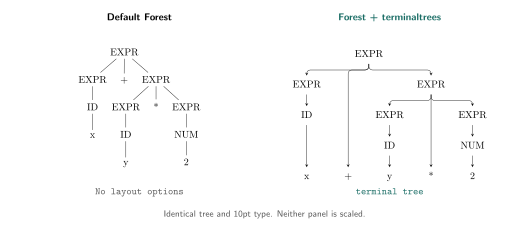

# terminaltrees

Evenly spaced leaves. Rounded branches. Ordinary Forest syntax.



[Zoom the vector comparison](examples/comparison.svg).

Add `terminal tree` to a [Forest](https://ctan.org/pkg/forest) tree to align its
leaves, center each parent between its first and last immediate children, and
draw rounded branches. Wider labels increase spacing automatically. Unary
chains connect straight down, as do children directly below their parent.

Both trees above use the same content and 10pt type, without scaling. The left
tree uses Forest's default layout. The right uses the layout provided by
terminaltrees, built on Forest's spacing and drawing tools.

## Draw a tree

Place `terminaltrees.sty` beside your document, or upload it to the same Overleaf
project. Your TeX installation needs Forest and `needspace`; Forest loads
PGF/TikZ. Compile this example with pdfLaTeX:

```latex
\documentclass{article}
\usepackage{terminaltrees}

\begin{document}
\begin{forest}
  terminal tree
  [EXPR
    [EXPR [ID [x]]]
    [+]
    [EXPR [EXPR [ID [y]]] [*] [EXPR [NUM [2]]]]
  ]
\end{forest}
\end{document}
```

This produces the right-hand tree. Remove `terminal tree` for the left-hand
layout. Use Forest's bracket syntax and ordinary LaTeX labels, including `\\`
for deliberate line breaks.

## Keep the type size, or fit the page

Both forms use Forest and the same layout:

- **Natural size:** use `forest` with `terminal tree`. You choose paper large
  enough for the tree and manage its placement, including in figures or minipages.
- **Fit to the existing layout:** use `fittedterminaltree` in ordinary
  single-column document flow. It shrinks the whole tree when needed and moves
  it to the next page if the remaining space is insufficient.

Neither form changes the paper or margins, enlarges a tree, or splits it across
pages. Fitting scales labels and branches together, subject to a font-size floor:

```latex
\begin{fittedterminaltree}(minimum label size=7pt)
  roundness=0.5,
  for tree={font=\small}
  [EXPR [EXPR [x]] [+] [EXPR [1]]]
\end{fittedterminaltree}
```

`fittedterminaltree` applies `terminal tree` automatically. Fitting settings go
in **parentheses** after the environment name. Forest options go before the
root bracket. Omit the parentheses to use the default minimum: the document's
current `\footnotesize` size.

The floor checks the base fonts selected with Forest's `font` option, after
scaling. It does not measure inline font changes, subscripts or externally
scaled content, and it is not a readability guarantee. If the floor cannot be
met, compilation stops. Wrap wide labels, increase an undersized node font, or
split the tree manually. Do not use a PDF left by a failed compilation.

Fitting supports normal flow, including lists, but rejects floats and minipages.
Use `forest` with `terminal tree` in those contexts. Custom output routines,
multicolumn layouts and automatic captions are unsupported by the fitting form.

The manual includes a side-by-side comparison on different paper sizes. To
generate it, see [Check and preview](#check-and-preview).

## Adjust the layout

Put layout options after `terminal tree`, or before the root bracket in
`fittedterminaltree`:

| Option | Default | Effect |
| --- | --- | --- |
| `leaf pitch` | `0pt` | Minimum distance between leaf centers. Zero leaves spacing entirely to label measurements and Forest's padding. |
| `roundness` | `1` | Curve factor from `0` (square) to `1` (largest bends that fit). Does not move nodes or change fitting. |

For example, `terminal tree, leaf pitch=3em, roundness=0.5` sets a minimum leaf
spacing and tighter bends. Both options reset for each tree. Forest's font,
label, arrow and vertical-spacing options remain available.

Equal leaf spacing does not imply equal internal sibling spacing. A parent is
centered over its immediate children, not necessarily all its descendant leaves.
A wide label can widen the whole tree. This is conservative spacing, not a
minimum-width layout.

The style controls horizontal positions and branch routing. Custom anchors,
shifted labels, overlays, edge labels and custom arrow styles need visual
inspection. The [manual source](terminaltrees-doc.tex) documents the geometry,
measurement limits and unsupported overrides in detail. The distribution
archive includes the compiled `terminaltrees-doc.pdf`.

Tested with pdfLaTeX on TeX Live 2023 (Ubuntu) and TeX Live 2026 (macOS).
Other engines and Overleaf execution have not been verified. The package does
not add tagged-PDF tree semantics or screen-reader support.

## Check and preview

From the checkout or extracted archive, run:

```sh
python3 terminaltrees-tests/check.py --preview
```

The checker needs Python 3, `pdflatex`, `pdfinfo`, `pdftotext`, `pdftocairo`, and
the `standalone` class. It prints the temporary directory containing the PDFs
and SVG. Geometry and rendering checks run without requiring the generated SVG
to match the committed one.

Open `fitting-overview.pdf` for a shared-scale comparison of natural-size and
fitted trees. `fitting-comparison.pdf` contains the actual-size pages and a third
page showing deliberate unfitted overflow. You choose the paper in both cases.
The example uses `leaf pitch=16mm`, not the default. Use the same zoom on each
actual-size page to preserve the comparison.

Without `--preview`, the checker also requires a byte-for-byte match with the
README SVG. To replace that image after all checks pass, run:

```sh
python3 terminaltrees-tests/check.py --update-readme-image
```

Different TeX, font or Poppler versions can change the SVG without changing the
layout. Review the rendering before accepting an image update.

### GitHub previews and the README image

PR checks upload validated renderings as `tree-previews-…` artifacts, retained
for 14 days. They never commit or push. New revisions cancel only that PR's
older run.

The [image workflow](https://github.com/edel67/terminaltrees/blob/main/.github/workflows/readme-image.yml) rebuilds the vector
comparison after pushes to `main`, runs the checks, and commits only if the
image changed. Failed checks leave the previous image in place. The
[example source](examples/comparison.tex)
defines one tree shared by both sides of the comparison.

## Build the manual and distribution archive

Run the checker first, then build with Python 3 and the TeX dependencies:

```sh
python3 terminaltrees-tests/check.py --preview
python3 build-ctan.py /path/to/new-output-directory
```

The output directory must not exist. The builder creates `terminaltrees-doc.pdf`
and `terminaltrees.zip`. The ZIP contains the files listed in
[manifest.txt](manifest.txt) under `terminaltrees/`.

## Versioning

Version numbers follow [Semantic Versioning](https://semver.org/) for the
documented environments and options. Incompatible interface changes require a
new major version.

## License, credits and support

Copyright 2026 Adi Edelhaus. Licensed under the [LaTeX Project Public License,
version 1.3c or later](LICENSE). Maintenance status: maintained.
Current maintainer: Adi Edelhaus.

[Report an issue](https://github.com/edel67/terminaltrees/issues).
The work's files are listed in [manifest.txt](manifest.txt).

Built on [Forest](https://ctan.org/pkg/forest) by Sašo Živanović,
[PGF/TikZ](https://ctan.org/pkg/pgf), the [LaTeX kernel](https://www.latex-project.org/)
and [needspace](https://ctan.org/pkg/needspace). These dependencies retain their
own licenses and are not bundled.
